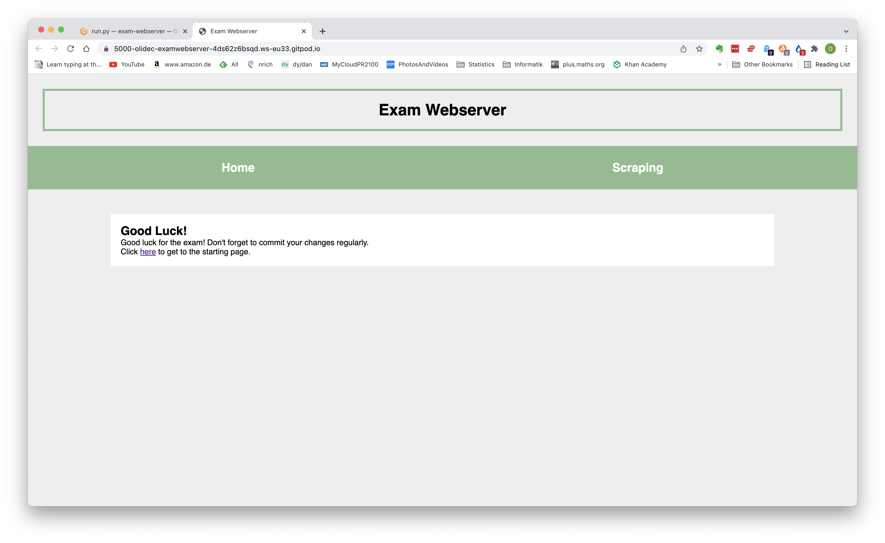

# Exam

This exam is open book which means that you may use any resources at your disposal.

**No direct communication with other persons!!!**

Work wich commits. At the latest after every exercise you should commit with the text *Exercise x finished*.

## Exercise 1 (Fork repository - 1 P.)

Fork this repository to your own github account.

## Aufgabe 2 (Styling - 3 P.)

Change `main.css` to match the following picture. Don't spend too much time on details.

## Aufagbe 3 (Webscraper - 4 P.)

1. Verwenden Sie den Link Scraping in der Navigationsleiste, dort finden Sie
   eine Tabelle. Welche Klasse hat die erste Spalte in der Tabelle?
3. Öffnen Sie die Datei `scrape.py` und lesen Sie durch den Code.
4. Führen Sie die Datei `scrape.py` aus. Was ist die Ausgabe?
6. Ändern Sie den Selektor im `scrape.py` so ab, dass nur noch die
   fettgedruckten von diesen Elementen ausgegeben werden.

## Aufgabe 4 (In die eigene Website einbauen - 4 P.)

1. Fügen Sie eine neue Datei `results.html` hinzu, die `base.html` erweitert.
1. Fügen Sie einen Link zur Navigationsleiste hinzu der Sie zu Ihrer
   Resultatseite bringt.
3. Stellen Sie den Inhalt der Datei `data.json` als Liste auf Ihrer Webseite
   dar. Es soll jeweils der **Name** und die **ID** angegeben werden. 

## Aufagbe 6 (Pull Request - 1 P.)

Erstellen Sie einen Pull Request zu dem Repository das Sie geforkt haben
(upstream).

## Aufgabe 7 (Bonus 1: Erstellen Sie ein neues Design - 2 P.)

Erstellen Sie einen neuen Branch in dem Sie ein alternatives Design entwickeln.
Erstellen Sie einen weiteren Pull Request von diesem Branch.
